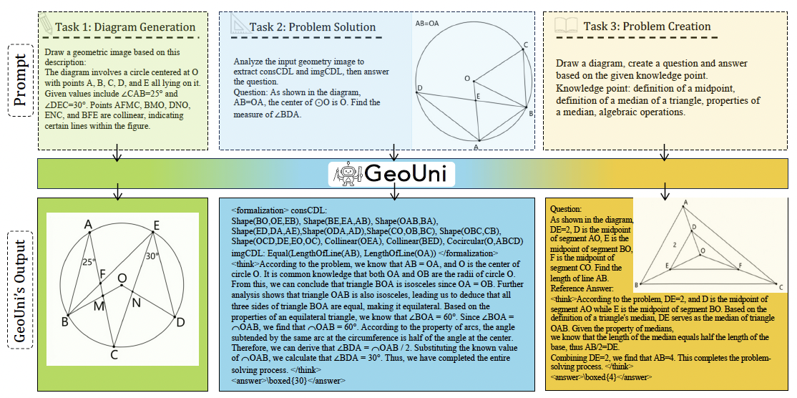
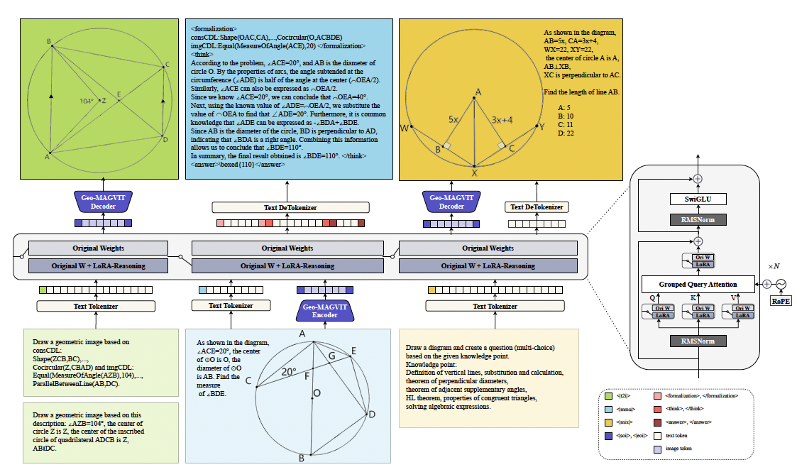

<div align="center">
<br>

<h2>A Unified Model for Generating Geometry Diagrams, Problems and Problem Solutions</h2>

[Jo-Ku Cheng](https://chengruogu0915.github.io/)<sup>1&#42;</sup>&nbsp;
Zeren Zhang<sup>1&#42;</sup>&nbsp;
Ran Chen<sup>1</sup>&nbsp;
<br>
Jingyang Deng<sup>1</sup>&nbsp;
Ziran Qin<sup>2</sup>&nbsp;
[Jinwen Ma](https://www.math.pku.edu.cn/teachers/jwma/homepage/)<sup>1</sup>


<sup>1</sup> Peking University&nbsp; <sup>2</sup> Shanghai Jiao Tong University&nbsp;
 
[](https://arxiv.org/abs/2504.10146) 

</div>


<p align="center">
  <b>Geo-MAGVIT</b>: 🤗 <a href="https://huggingface.co/JO-KU/Geo-MAGVIT">Geo-MAGVIT</a> &nbsp;|&nbsp;
  <b>GeoUni-Instruct</b>: 🤗 <a href="https://huggingface.co/JO-KU/GeoUni-Instruct">GeoUni-Instruct</a> &nbsp;|&nbsp;
  <b>GeoUni-Reasoning-Adapter</b>: 🤗 <a href="https://huggingface.co/JO-KU/GeoUni-Reasoning-Adapter">GeoUni-Reasoning-Adapter</a>
</p>


<p align="center">
  
</p>

We propose **GeoUni**, the first unified geometry expert model capable of generating problem solutions and diagrams within a single framework in a way that enables the creation of unique and individualized geometry problems.

The overview below illustrates the core components of GeoUni:  
- <b>Geo-MAGVIT</b> serves as a specialized vision tokenizer for geometric diagrams, effectively capturing fine-grained structural features and enabling precise diagram reconstruction.
- <b>GeoUni-Instruct</b> supports diagram generation, basic geometry problem-solving, and problem creation based on specific knowledge points.  
- <b>GeoUni-Reasoning-Adapter</b> enhances the model’s reasoning capability and integrates seamlessly into the unified architecture.

<p align="center">
  
</p>

### Quick Start
Before running the script, install the following dependencies:

```shell
pip install -r requirements.txt
```

To run a simple inference demo as shown above:

#### Inference demo for Diagram Generation
```bash
python simple_infer.py t2d \
  --prompt "Draw a geometric image based on this description: The diagram involves a circle centered at O with points A, B, C, D, and E all lying on it. Given values include ∠CAB=25° and ∠DEC=30°. Points AFMC, BMO, DNO, ENC, and BFE are collinear, indicating certain lines within the figure." 
```

#### Inference demo for Problem Solution
```bash
python simple_infer.py mmu \
  --image_path ./images/6901.png \
  --question "As shown in the diagram, AB=OA, the center of \u2299O is O. Find the measure of \u2220BDA." 
```

#### Inference demo for Problem Creation
```python
python simple_infer.py mixing \
  --prompt "Draw a diagram, create a question and answer based on the given knowledge point. Knowledge point: definition of a midpoint, definition of a median of a triangle, properties of a median, algebraic operations." 
```

### Citation
To cite the paper and model, please use the below:

```
@misc{cheng2025geouniunifiedmodelgenerating,
      title={GeoUni: A Unified Model for Generating Geometry Diagrams, Problems and Problem Solutions}, 
      author={Jo-Ku Cheng and Zeren Zhang and Ran Chen and Jingyang Deng and Ziran Qin and Jinwen Ma},
      year={2025},
      eprint={2504.10146},
      archivePrefix={arXiv},
      primaryClass={cs.LG},
      url={https://arxiv.org/abs/2504.10146}, 
}
```


  
